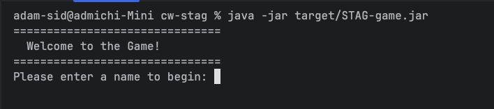

# java-game-engine

This is a game engine written in java that processes DOT and XML files. DOT files contain game entities including locations, objects, furniture, characters and players. XML files contain actions that a player can do in the game (beyond the basic included actions described below). The engine parses these files and builds a game world from them. The game can then be played using the terminal and supports multiplayer.

## Set-up

1. Ensure you have maven and java (minimum version 17) installed
2. Clone repo and from the root directory (cw-stag) run the following:
```bash
mvn clean package
```
Which compiles the program and creates an executable jar file. Then run:
```bash
java -jar target/STAG-game.jar
```
Which runs the program. You should see the following:


## Playing the game

The game is a turn based text adventure game (think zork). You interact with the game world by typing in actions to the command line

### Basic actions


### Multiplayer

### Health

### Creating your own "maps" and actions

